# Design 

The first step of the process involved designing the solution. 

Alongside it being specified, an Object-Oriented approach was chosen as it allowed for the principles of SOLID () to be more stringently enforced. 
Most notably - the Liskov Substitution and Dependency Inversion Principles.

## UML Diagram

The first step was to create a UML Diagram of the solution. 
Mermaid was chosen as it allowed for the creation of such a diagram through an intuitive markdown-based language. It also had an integration with Rider.

Firstly - the classes of the 'entities' in this case needed to be identified.

I conceptualised a basic layout without relationships based on my ERD of the scenario last year.

<!--- Class Diagram for GMMR Systems -->

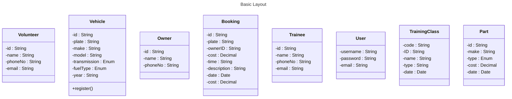
```mermaid
---
title: Basic Layout
---
classDiagram
	class Volunteer{
	-id : String
	-name : String
	-phoneNo : String
	-email : String
	}
	class Vehicle{
	-id : String
	-plate : String
	-make : String
	-model : String
	-transmission : Enum
	-fuelType : Enum
	-year : String
	+register()
	}
	class Owner{
	-id : String
	-name : String
	-phoneNo : String
	}
	class Booking{
    -id : String
    -plate : String
    -ownerID : String
    -cost : Decimal
    -time : String
    -description : String
    -date : Date
    -cost : Decimal
    }
    class Trainee{
    -id : String
    -name : String
    -phoneNo : String
    -email : String
    }
    class User{
    -username : String
    -password : String
    -email : String
    }
    class TrainingClass{
    -code : String
    -ID : String
    -name : String
    -type : String
    -date : Date
    }
    class Part {
    -id : String
    -make : String
    -type : Enum
    -cost : Decimal
    -date : Date
    }
```

As this concept developed, multiple changes were made from the classic previous ERD diagram 

### Handling 'Foreign' Values

Lookup tables created were dropped from this implementation as the logic with shared attributes that otherwise would be 'foreign keys' in other classes would be abstracted in the SQL implementation.

### Changing Data Types

Some entities were intended to hold a preset of values. One example would be the property `Transmission` which stored the transmission of the car.
This can have the values of - `Automatic`, `Manual` or `Semi-Auto`. For this reason, such properties when translated to attributes in the class diagram were chosen to be **enumerations** to define a strict set of constants that transmissions can be, nothing else.

In UML class diagrams an Enum is declared with the tags of `<<Enumeration>>`; thus leading to the additional classes for `Transmission`, FuelType, now named `Engine` and `Type` for `type` in `TrainingClass`

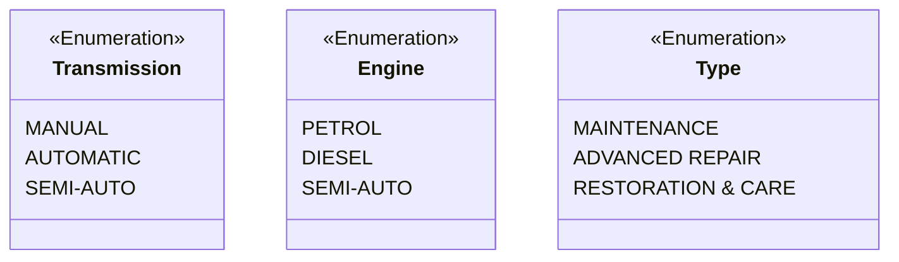
```mermaid
classDiagram
    class Transmission {
    <<Enumeration>>
        MANUAL
        AUTOMATIC
        SEMI-AUTO
    }
    class Engine {
    <<Enumeration>>
        PETROL
        DIESEL
        SEMI-AUTO
    }
    class Type {
        <<Enumeration>>
        MAINTENANCE
        ADVANCED REPAIR
        RESTORATION & CARE
    }
```

### Defining Custom Types

For further enforcement of SOLID principles we can define a data type from a class.

For example - `Booking` requires a vehicle registration plate. Initially this was simply assigned as a string - a future problem was identified where atomicity would not be as enforced as a registration plate could be entered without a `Vehicle` entry it came from. Therefore introducing the scenario of mismatched or even no `Vehicle` entry being present with the entered plate. 

Leading to the correction below, where rather than a constant string holding the reg plate of the booking, an entire `Vehicle` project is held. Ergo, **dependency injection** can be implemented where a booking requires a previously registered `BookedVehicle` Vehicle record or a new one. 

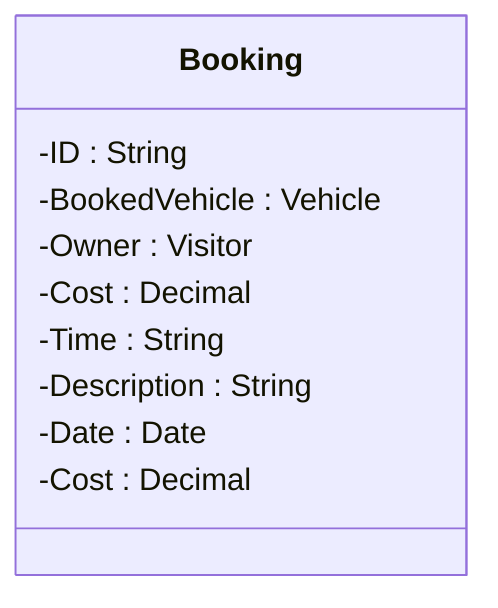
```mermaid
classDiagram
    class Booking{
        -ID : String
        -BookedVehicle : Vehicle
        -Owner : Visitor
        -Cost : Decimal
        -Time : String
        -Description : String
        -Date : Date
        -Cost : Decimal
        }
``` 

Additionally, as seen above -  the owner ID associated with the booking has been changed to an instance of the new generic `Visitor` type that will encompass motorists that visit GMMW for any reason. Eliminating the need for separate `Trainee` and `Owner` classes. 

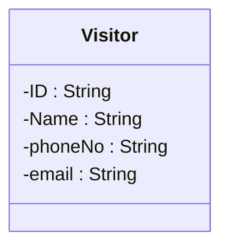
```mermaid
classDiagram
    class Visitor {
        -ID : String
        -Name : String
        -phoneNo : String
        -email : String
    }
``` 
Finally, an additional `Repair` class was created to allow for greater granularity in tracking what was done in a booking. `Repair` required a booking to be created that it was linked to. This way, bookings that involved multiple individual repairs could be listed, satisfying the condition of them being able to be 'drilled down' to in the interface. Parts would be stored in a strictly defined **list** for them, meaning a repair can use multiple parts. The cost will then calculate the total of the individual cost of each item.

Leading to a relationship between `Booking`, `Repair` and `Part` as shown

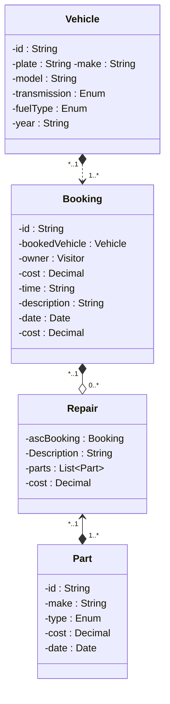
```mermaid
classDiagram
    Booking "*..1" *--o "0..*" Repair
    Repair "*..1" <--* "1..*" Part
    Vehicle "*..1" *..> "1..*" Booking
    class Vehicle{
        -id : String
        -plate : String -make : String
        -model : String
        -transmission : Enum
        -fuelType : Enum
        -year : String
    }
    class Booking{
        -id : String
        -bookedVehicle : Vehicle
        -owner : Visitor
        -cost : Decimal
        -time : String
        -description : String
        -date : Date
        -cost : Decimal
    }
    class Repair {
        -ascBooking : Booking
        -Description : String
        -parts : List~Part~
        -cost : Decimal
    }
    class Part {
        -id : String
        -make : String
        -type : Enum
        -cost : Decimal
        -date : Date
    }
``` 

### Adding Interfaces

Additionally, it was identified that Dependency Inversion could be more strictly enforced with the creation of a `Volunteer` interface that has concrete implementations either as the class `Student` or `Lecturer` as they are near-identical in attributes. 
This `Volunteer`interface will now hold the abstract attributes and methods shared by both implementations. In the UML - this would be represented by the two implementations not containing attributes or methods they realise.

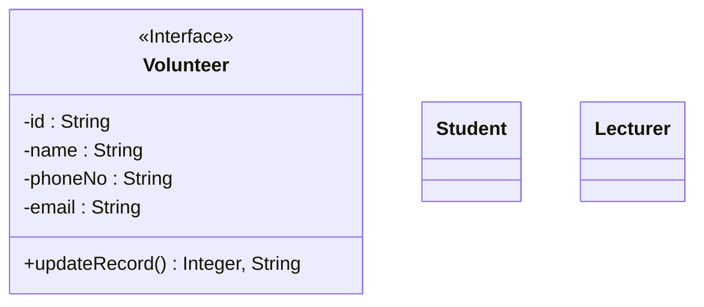
```mermaid
classDiagram
    class Volunteer{
        <<Interface>>
        -id : String
        -name : String
        -phoneNo : String
        -email : String
        +updateRecord() Integer, String
    }
    class Student{ }
    class Lecturer{ }
```
In this case, the method `updateRecord()` will allow for an editable field like phoneno or email to be updated by providing a number argument to specify which field to update

This was improved further modifying the `User` class to require a Volunteer generic type in construction. With this change, users on the system would have a more simplified and robust connection to their actual records with their 'volunteer ID' being required for login rather than an additional username. 

As a result, other attributes like `email` can be dropped as the users would already have a linked one to their record, thus leaving only the password as the remaining additional attribute. Thus preventing inconsistency between a person's system 'user' and 'record' in the workshop:

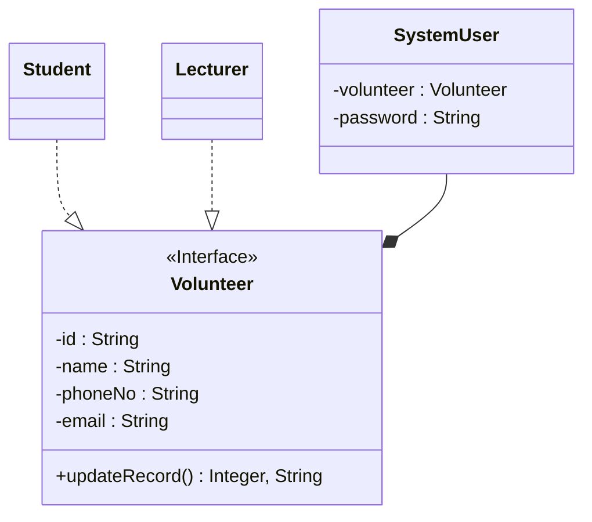
```mermaid
classDiagram
    class Volunteer{
        <<Interface>>
        -id : String
        -name : String
        -phoneNo : String
        -email : String
        +updateRecord() Integer, String
    }
    Student ..|> Volunteer
    Lecturer ..|> Volunteer
    SystemUser --* Volunteer
    class Student{ }
    class Lecturer{ }
    class SystemUser {
    -volunteer : Volunteer
    -password : String
    }
```

Additionally, it would provide benefits in:
* **User Experience** - it would overall improve the UX when implemented as 'volunteers' will only need to update their contact info once to see it applied on both ends 
* **Security** - To change more sensitive information like that, a user would need to request an admin to manually change it for them using the object's implementation of `updateRecord()`. Preventing malicious abuse or accidental modification that can put the system at risk

It was later realised this could be taken further as the question arose on how the 'Admin User' would be implemented.

The brief implies that both students and lecturers involved in the workshop can be admin users in this extract:

> *"it is possible that an 
admin user may not actually be a volunteer who repairs vehicles or delivers classes......
> so they may equally be one 
of the lecturers or a student."*

In this case the brief previously states that volunteers include the students who actually repair vehicles while lecturers do, implying that both can become 'admin users'. 

Initially it was thought therefore, an `AdminUser` entity alongside the `SystemUser`, now renamed to `VolUser` representing a standard user can be another composite class containing a field requiring an entry of the `Volunteer` type, like below:

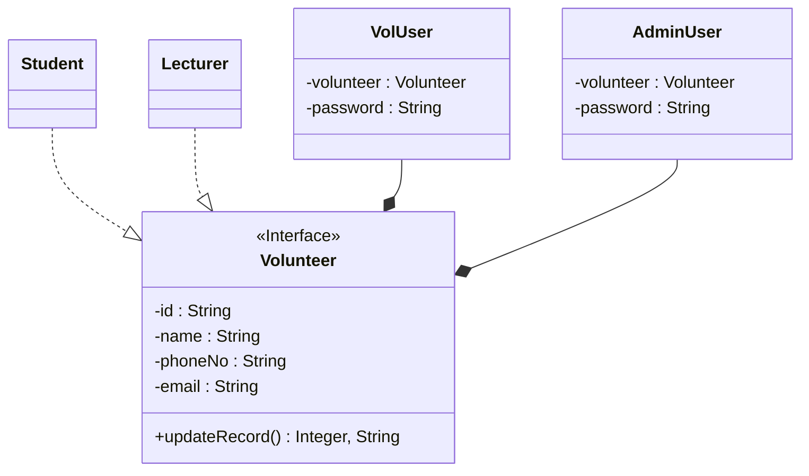
```mermaid
classDiagram
    class Volunteer{
        <<Interface>>
        -id : String
        -name : String
        -phoneNo : String
        -email : String
        +updateRecord() Integer, String
    }
    Student ..|> Volunteer
    Lecturer ..|> Volunteer
    VolUser --* Volunteer
    AdminUser --* Volunteer
    class Student{ }
    class Lecturer{ }
    class VolUser {
    -volunteer : Volunteer
    -password : String
    }
    class AdminUser {
        -volunteer : Volunteer
        -password : String
    }
```
However it also specifies that 'admin users' can be people whose sole role is to administer the system - as shown here:

> *".... but someone whose role is purely to administer the system on behalf of those who do"*

Ergo, an individual who is not involved in repairs in anyway. This individual would therefore not fit as they'd also need their own contact details in the system.

The initial thought then was to have a child interface called `SystemUser` inheriting from `Volunteer` that would have`AdminUser` and `VolUser` as implementations. 

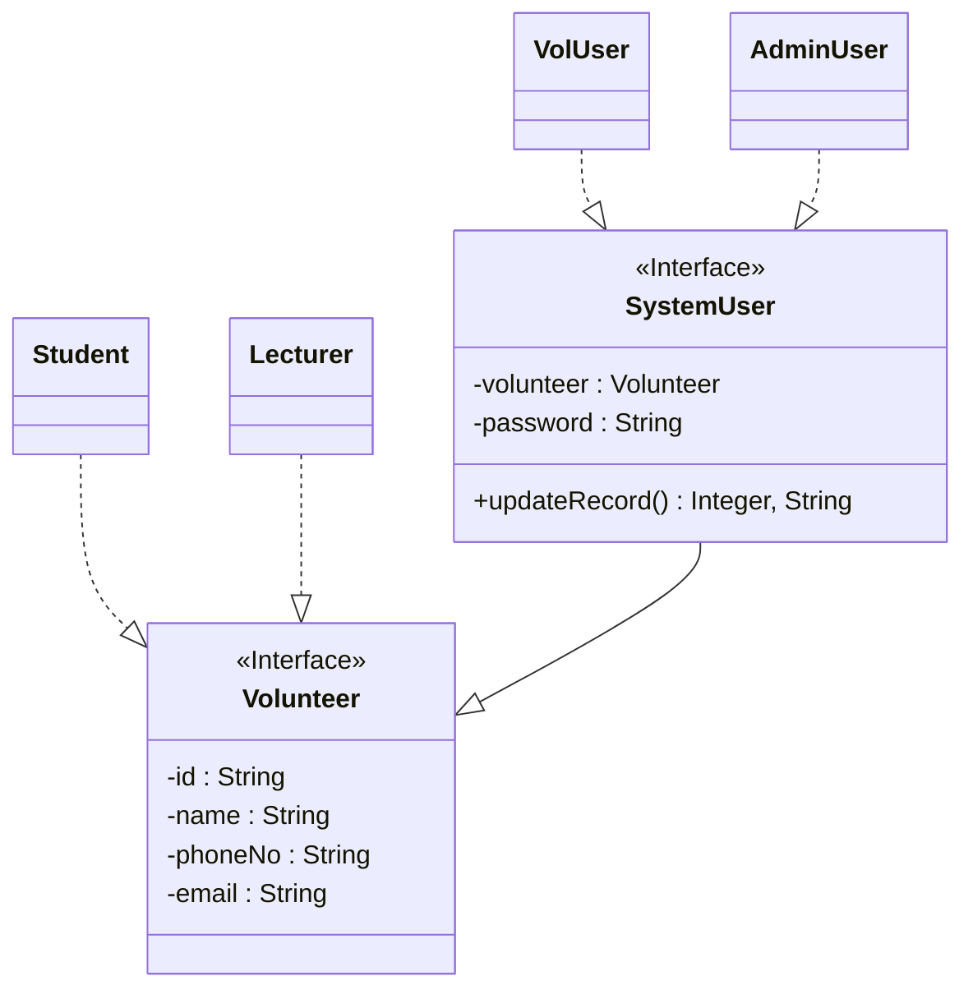
```mermaid
classDiagram
    class Volunteer{
        <<Interface>>
        -id : String
        -name : String
        -phoneNo : String
        -email : String
    }
    class SystemUser{
    <<Interface>>
    +updateRecord() Integer, String
    }
    Student ..|> Volunteer
    Lecturer ..|> Volunteer
    SystemUser --|> Volunteer
    class Student{ }
    class Lecturer{ }
    class SystemUser {
    -volunteer : Volunteer
    -password : String
    }
    VolUser ..|> SystemUser
    AdminUser ..|> SystemUser
    class VolUser { }
    class AdminUser { }
```

After pondering, it was finalised to instead only have the `SystemUser` class inheriting with an enum type that stores the individual's 'role' on a system. This way if a standard 'volunteer' user is promoted to also handle administration, only their role would need to be changed rather than remove their existing user on the system and re-register as an admin there.

Furthermore it would also result in a more robust and thus secure implementation of authorisation as only a single `role' value would be referred to when handling users login rather than implementing logic for object identification for such as system.

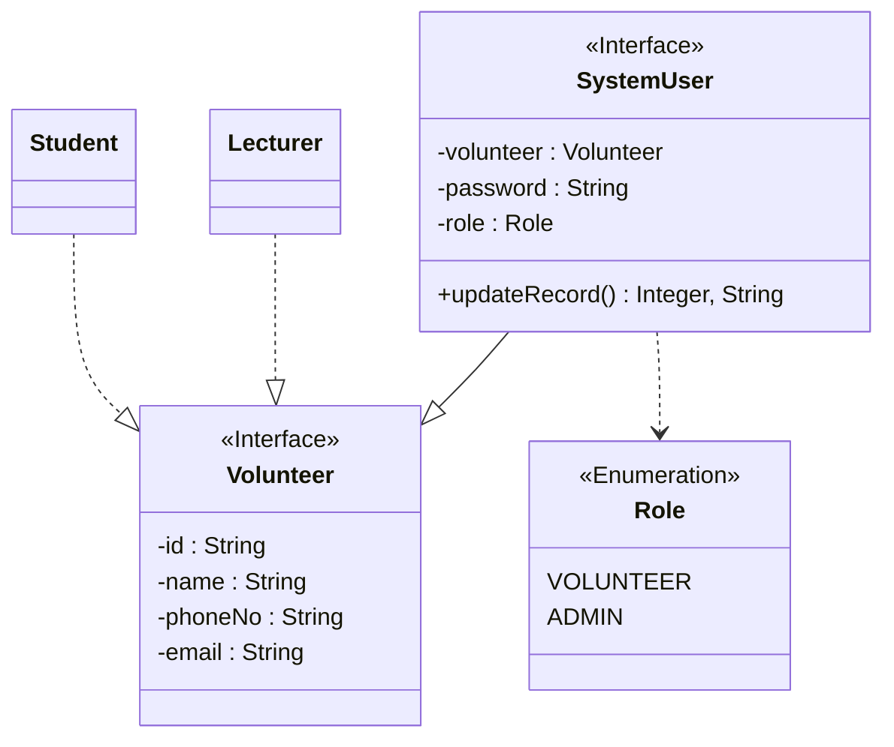
```mermaid
classDiagram
    class Volunteer{
        <<Interface>>
        -id : String
        -name : String
        -phoneNo : String
        -email : String
    }
    class SystemUser{
        <<Interface>>
        +updateRecord() Integer, String
    }
    Student ..|> Volunteer
    Lecturer ..|> Volunteer
    SystemUser --|> Volunteer
    class Student{ }
    class Lecturer{ }
    class Role{
        <<Enumeration>>
        VOLUNTEER
        ADMIN
    }
    class SystemUser {
        -volunteer : Volunteer
        -password : String
        -role : Role
    }
    SystemUser ..> Role
```
### Final Diagram

With all the amendments implemented that are specified above, alongside additional rectifications listed below, including:

+ Adding a `Lecturer` field called `supervisor` to `Booking` which will display the lecturer(s) who were involved in supervising the repair
+ Rectifying the `repairers` field to *only* take Student entries rather than Lecturer ones as the brief implies they are involved in actual repairs
+ Rectifying the `repairers` field to accept multiple students in the form of a list if they were involved in the same singular repair as the brief does not declare 
+ Changing the name of the `Volunteer` interface to `Staff` to better reflect the types of users for the system.
 
The final diagram composed was as follows:

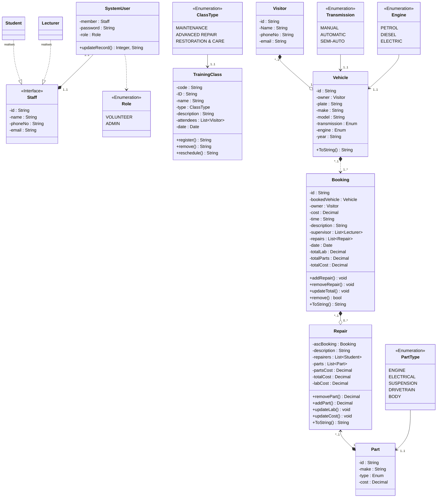
```mermaid
classDiagram
    class Staff{
        <<Interface>>
        -id : String
        -name : String
        -phoneNo : String
        -email : String
    }
    class Student{ }
    class Lecturer{ }
    class Role{
        <<Enumeration>>
        VOLUNTEER
        ADMIN
    }
    class SystemUser {
        -member : Staff
        -password : String
        -role : Role
        +updateRecord() Integer, String
    }
    SystemUser ..> Role
    Student "realises" ..|>  Staff
    Lecturer "realises" ..|> Staff
    SystemUser "1..1" --* "1..1" Staff
    class Visitor {
        -id : String
        -Name : String
        -phoneNo : String
        -email : String
    }
    class ClassType {
        <<Enumeration>>
        MAINTENANCE
        ADVANCED REPAIR
        RESTORATION & CARE
    }
    ClassType --> "1..1" TrainingClass
    class TrainingClass{
        -code : String
        -ID : String
        -name : String
        -type : ClassType
        -description : String
        -attendees : List~Visitor~
        -date : Date
        +register() String
        +remove() String
        +reschedule() String
    }
    class Transmission {
        <<Enumeration>>
        MANUAL
        AUTOMATIC
        SEMI-AUTO
    }
    class Engine {
        <<Enumeration>>
        PETROL
        DIESEL
        ELECTRIC
    }
    class PartType {
        <<Enumeration>>
        ENGINE
        ELECTRICAL
        SUSPENSION
        DRIVETRAIN
        BODY
    }
    Visitor "*..1" *--o "1..*" Vehicle
    Transmission --> "1..1" Vehicle
    Engine --> "1..1" Vehicle
    class Vehicle{
        -id : String
        -owner : Visitor
        -plate : String
        -make : String
        -model : String
        -transmission : Enum
        -engine : Enum
        -year : String
        +ToString() String
    }
    Vehicle "*..1" *..> "1..*" Booking
    class Booking{
        -id : String
        -bookedVehicle : Vehicle
        -owner : Visitor
        -cost : Decimal
        -time : String
        -description : String
        -supervisor : List~Lecturer~
        -repairs : List~Repair~
        -date : Date
        -totalLab : Decimal
        -totalParts : Decimal
        -totalCost : Decimal
        +addRepair() void
        +removeRepair() void
        +updateTotal() void
        +remove() bool
        +ToString() String
    }
    Booking "*..1" *--o "0..*" Repair
    class Repair {
        -ascBooking : Booking
        -description : String
        -repairers : List~Student~
        -parts : List~Part~
        -partsCost : Decimal
        -totalCost : Decimal
        -labCost : Decimal
        +removePart() Decimal
        +addPart() Decimal
        +updateLab() void
        +updateCost() void
        +ToString() String
    }
    Repair "*..1" <--* "1..*" Part
    PartType --> "1..1" Part
    class Part {
        -id : String
        -make : String
        -type : Enum
        -cost : Decimal
    }
```

## Flowcharts

### Initial Page
The next stage was to devise a flowchart to mainly display the flow of program logic. 

Analysing the brief, it was decided that the best method of approaching the display of the training classes was to have it be the default page and always display unless a staff member chooses to select the 'login' option. 

This way the system will display all the essential information visitors need by default, there would ideally be no method of getting 'lost' in this side of the system. While retaining functionality for staff to perform any quick changes at the scene if needed.

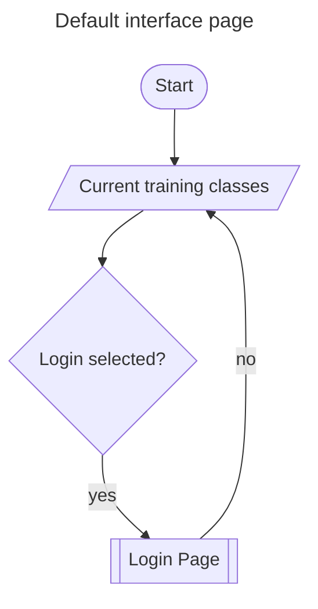
```mermaid
---
title: Default interface page
---
flowchart TD 
    n1([Start])
    --> n2[/Current training classes/]
        --> n3{Login selected?}
            -- yes --> n4[[Login Page]]
            -- no --> n2
```

### User Authentication

#### Login Page

This would be presented immediately after clicking the Login button. 

At the start - the staff member would be provided an option to sign up - bringing them to a separate page that is elaborated further below.

For the logic in taking the user's input - the best method identified was through only allowing the input of numbers in the staffID field, continuously parsing entered characters until the set limit of the length of the entry was reached, which in this case for now 4 was chosen.

>[!INFO]
> T

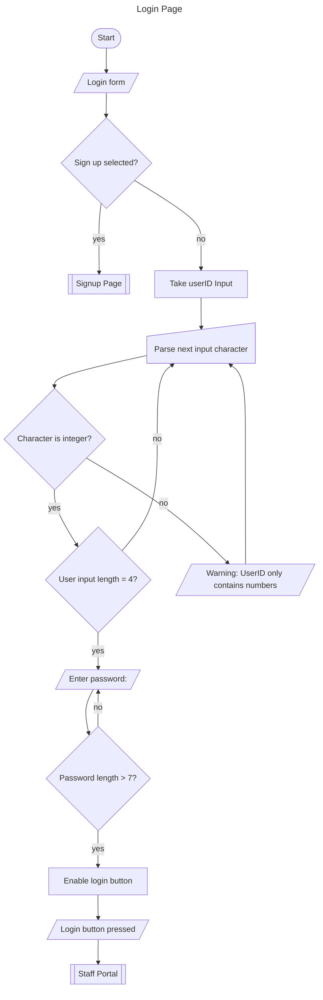
```mermaid
---
title: Login Page
---
flowchart TD 
    n1@{shape: stadium, label: "Start"}
    --> n2@{shape: lean-r, label: "Login form"}
        --> n3@{shape: diamond, label: "Sign up selected?"}
            n3 -- yes ---> n4@{shape: subproc, label: "Signup Page"}
            n3 -- no ---> n5@{shape: process, label: "Take userID Input"}
            n5 --> n6@{shape: manual-input, label: "Parse next input character"}
            n6 --> n7@{shape: diamond, label: "Character is integer?"}
                n7 -- yes --> n8@{shape: diamond, label: "User input length = 4?"}
                    n8 -- no --> n6
                    n8 -- yes --> n10@{shape: lean-r, label: "Enter password:"}
                        n10 --> n11@{shape: diamond, label: "Password length > 7?"}
                            n11 -- yes --> n12@{shape: process, label: "Enable login button"}
                                n12 --> n13@{shape: lean-r, label: "Login button pressed"}
                                    n13 --> n14@{shape: subproc, label: "Staff Portal"}
                            n11 -- no --> n10
            n7 -- no --> n9@{shape: lean-r, label: "Warning: UserID only contains numbers"}
                n9 --> n6
```

#### Signup Page

This page would simply tell the staff user to get into contact with an administrator if they want to create an account, it could list general contact information such as an email associated with that user group. The only other option on this page would be to return to the home default page or to the login page.

### 'Garage Menu'

This menu would manage 'bookings' made for repairs at the workshop. Operated by both student and lecturer volunteers.

This is probably the most expansive part of the implementation which means it will be split up into multiple sections which will be further elaborated with respectively

#### 'Welcome Page'

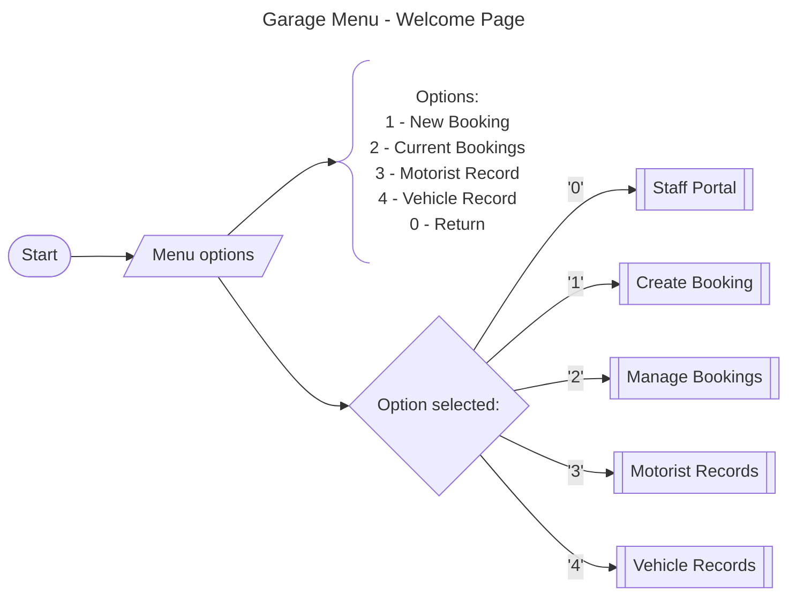
```mermaid
---
title: Garage Menu - Welcome Page
---
flowchart LR 
    n1@{shape: stadium, label: "Start"}
        n1 --> n2@{shape: lean-r, label: "Menu options"}
            n2 --> n3@{shape: comment, label: "Options: \n 1 - New Booking \n 2 - Current Bookings \n 3 - Motorist Record \n 4 - Vehicle Record \n 0 - Return"}
            n2 --> n4@{shape: diamond, label: "Option selected:"}
                n4 -- '0' --> n5@{shape: subproc, label: "Staff Portal"}
                n4 -- '1' --> n6@{shape: subproc, label: "Create Booking"}
                n4 -- '2' --> n7@{shape: subproc, label: "Manage Bookings"}
                n4 -- '3' --> n8@{shape: subproc, label: "Motorist Records"}
                n4 -- '4' --> n9@{shape: subproc, label: "Vehicle Records"}
```
#### 'Create Booking'

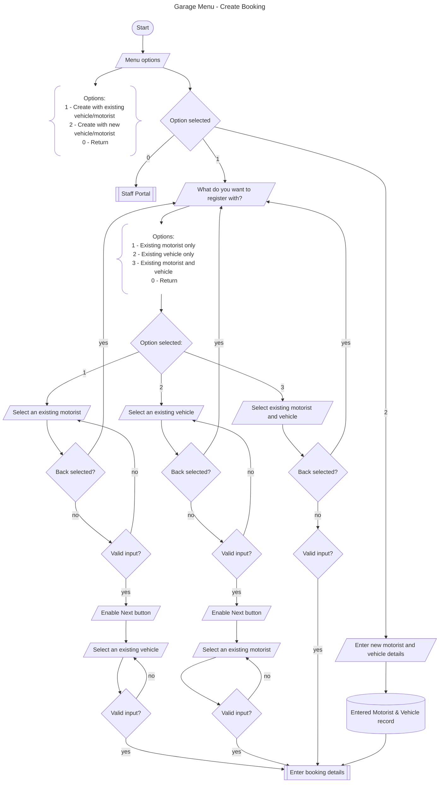
```mermaid
---
title: Garage Menu - Create Booking
---
flowchart TD

n1([Start])
n1 --> n2[/Menu options/]
n2 --> options@{shape: braces, label: "Options: \n 1 - Create with existing vehicle/motorist \n 2 - Create with new vehicle/motorist \n 0 - Return"}
n2 --> n3{Option selected}
n3 -- "0" --> n4a[[Staff Portal]]
n3 -- "1" --> n4b[/What do you want to register with?/]
n4b --> optp@{shape: comment, label: "Options: \n 1 - Existing motorist only \n 2 - Existing vehicle only \n 3 - Existing motorist and vehicle \n 0 - Return"}
optp --> n6{Option selected:}
n6 -- "1" --> n7a[/Select an existing motorist/]
n7a --> n8a{"Back selected?"}
n8a -- yes --> n4b
n8a -- no --> n9a{Valid input?}
n9a -- yes --> n10a[/Enable Next button/]
n10a --> n11a[/Select an existing vehicle/]
n11a --> n12a{Valid input?}
n12a -- yes --> nBooking[[Enter booking details]]
n12a -- no --> n11a
n9a -- no --> n7a
n6 -- "2" --> n7b[/Select an existing vehicle/]
n7b --> n8b{Back selected?}
n8b -- yes --> n4b
n8b -- no --> n9b{Valid input?}
n9b -- yes --> n10b[/Enable Next button/]
n10b --> n12b[/Select an existing motorist/]
n12b --> n13b{Valid input?}
n13b -- yes --> nBooking
n13b -- no --> n12b
n9b -- no --> n7b
n6 -- "3" --> n7c[/Select existing motorist and vehicle/]
n7c --> n8c{Back selected?}
n8c -- yes --> n4b
n8c -- no --> n9c{Valid input?}
n9c -- yes --> nBooking
n3 -- "2" --> n4store[/Enter new motorist and vehicle details/]
n4store --> n5store@{shape: cyl, label: "Entered Motorist & Vehicle record"}
n5store --> nBooking
```

#### 'Manage Bookings'

In this sub-menu - users would be greeted with a list of bookings they can manage. At the very least - in compliance with the requirements of the brief, the system should allow staff, including student and lecturer volunteers to:
+ Add or modify existing repairs 'added' to the booking - which would include their associated information (elaborated in ![Manage Booking Repairs]) 
+ Add or modify existing lecturer(s) 'assigned' to supervise the repairs in the booking.
+ Automatically calculate the final cost of the booking from the repairs associated with this (elaborated further in ![Manage Booking Repairs])
+ Change motorist(owner) details associated with the booking, if necessary
+ Change vehicle details associated with the booking, if necessary
+ 

##### Manage Repairs

#### 'Manage Motorists'

#### 'Manage Motorists'

#### Booking Menu

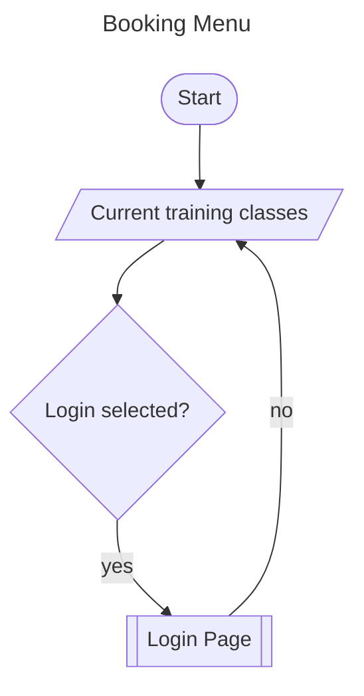
```mermaid
---
title: Booking Menu
---
flowchart TD 
    n1([Start])
    --> n2[/Current training classes/]
        --> n3{Login selected?}
            -- yes --> n4[[Login Page]]
            -- no --> n2
```

#### Repair Menu
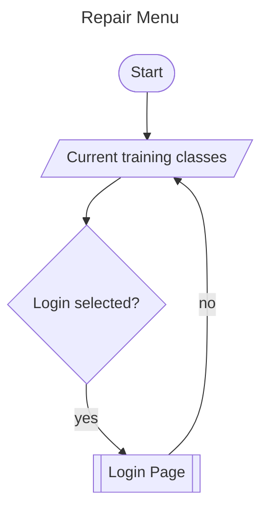
```mermaid
---
title: Repair Menu
---
flowchart TD 
    n1([Start])
    --> n2[/Current training classes/]
        --> n3{Login selected?}
            -- yes --> n4[[Login Page]]
            -- no --> n2
```

### Training Class Menu

This is another menu that would only be accessible by student users. 

Upon clicking the menu entry, they will be greeted with a 'timetable' of the classes every given Saturday, with an option to advance it to the next or previous ones. This would likely presented through an embedded scheduler or day calender component in the web implementation.

Below would be the list of training classes created. These entries will be in a table-like format including columns for important data such as their type, date and student delivering the class.

The table format should therefore in theory allow the list to be easily filterable by date alongside the student 'delivering' the class as the brief states.

Beyond the list, there would be an option of 'all attendees' where they can view a filterable list of all motorists attending classes including details associated with them such as classes they attended as well as their calculated attendance rate from classes they attended prior from which additional functionality can be introduced such as sending emails to attendees whose attendance drops below a certain threshold and obtain feedback why they don't attend the classes anymore.

If they want to perform an action to an existing class they must first click it where they'll be greeted with a details page and the management actions that can be done including:
+ Modifying the attendee list of the class, including:
  + 'Enrolling' a new student to the class, either assigning one from an existing 'visitor' or creating a new one
  + 'De-enrolling' an existing one.
+ Modifying the date of the class 
+ Modifying the student volunteer assigned to teach the class

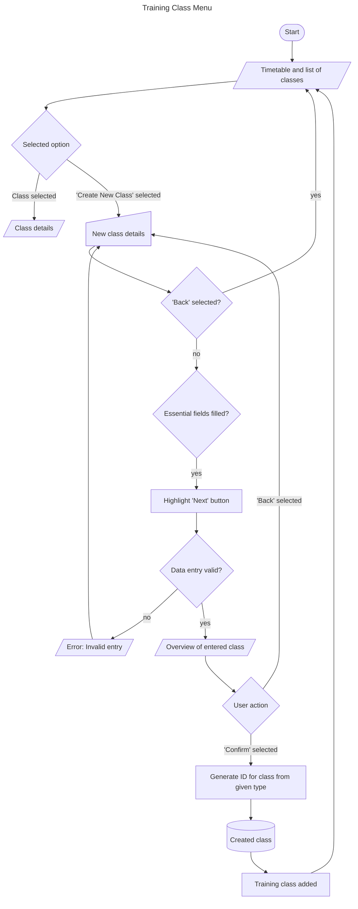
```mermaid
---
title: Training Class Menu
---
flowchart TD 
    n1([Start])
    --> menu[/Timetable and list of classes/]
        --> prompt1{Selected option}
            prompt1 -- Class selected --> details[/Class details/]
            prompt1 -- 'Create New Class' selected --> newclass@{shape: manual-input, label: "New class details"}
	        newclass --> back{'Back' selected?}
		        back -- yes --> menu
		        back -- no --> filled{Essential fields filled?}
			        filled -- yes --> enablebtn[Highlight 'Next' button]
				        enablebtn --> valid{Data entry valid?}
						valid -- no --> error[/Error: Invalid entry/] --> newclass
			            valid -- yes --> overview[/Overview of entered class/]
				            overview --> confirm{User action}
					            confirm -- 'Back' selected --> newclass
					            confirm -- 'Confirm' selected --> idgen[Generate ID for class from given type]
						            idgen --> store[(Created class)]
							            store --> success[Training class added] --> menu
```

#### Creating a Class

Upon clicking the create class button, the user would be brought to a form where they can enter the details about the class. Essential fields would include the name, obvious valid date on a Saturday set,  duration, set class type from a predefined list in a dropdown alongside an assigned student volunteer. If those fields are filled, the 'Next' button will be highlighted. After which if clicked will only present the summary page if the input data is valid. 

The summary page offers the user another chance to look over their entered data and return to make any amendments if needed. From there they can confirm where a suitable ID depending on the type assigned to the class will be generated and assigned to it. Thus finally creating it's entry in the training class table.

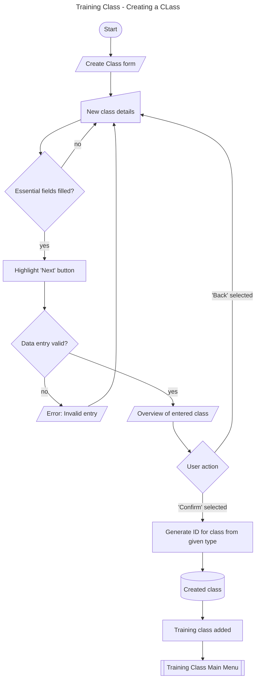
```mermaid
---
title: Training Class - Creating a CLass
---
flowchart TD 
    n1([Start])
    --> menu[/Create Class form/]
            --> newclass@{shape: manual-input, label: "New class details"}
	        newclass
		         --> filled{Essential fields filled?}
					filled -- no --> newclass
			        filled -- yes --> enablebtn[Highlight 'Next' button]
				        enablebtn --> valid{Data entry valid?}
						valid -- no --> error[/Error: Invalid entry/] --> newclass
			            valid -- yes --> overview[/Overview of entered class/]
				            overview --> confirm{User action}
					            confirm -- 'Back' selected --> newclass
					            confirm -- 'Confirm' selected --> idgen[Generate ID for class from given type]
						            idgen --> store[(Created class)]
							            store --> success[Training class added] --> return[[Training Class Main Menu]]
```

#### Managing Enrolment

This feature is one of the functions that are presented to users when they click on a class in the list - bringing them to it's dedicated details page. 

Managing Enrolment will include both enrolling attendees to created classes as well as de-enrolling them. 

The concept is that after clicking the 'Add' button at the top of the list component, volunteers can simply enter the first few letters of a name to receive suggestions matching that, greatly streamlining the process. 

When de-enrolling the user will be offered an option to remove the selected attendee from the motorist record entirely if they wish to not attend any further classes in compliance with GDPR.

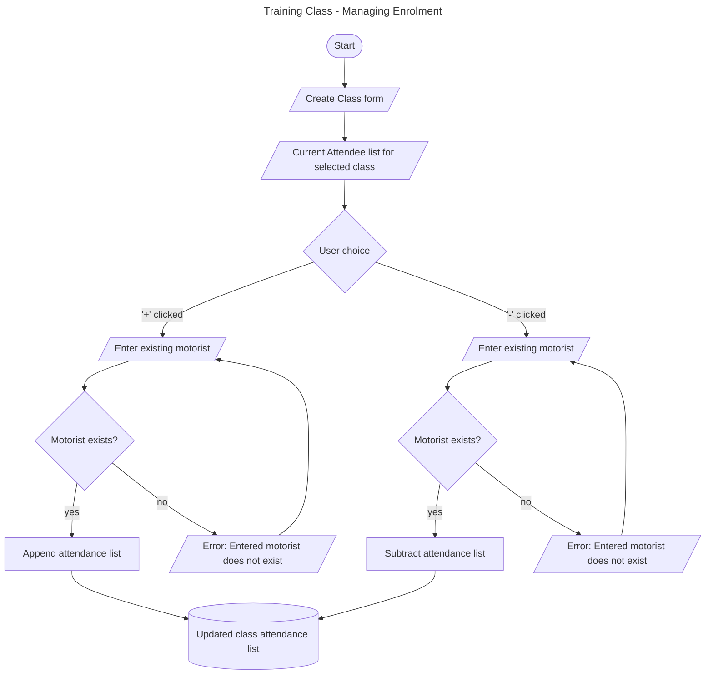
```mermaid
---
title: Training Class - Managing Enrolment
---
flowchart TD 
    n1([Start])
    --> menu[/Create Class form/]
            --> newclass[/Current Attendee list for selected class/]
	        newclass --> choice{User choice}
		        choice -- '+' clicked --> add[/Enter existing motorist/] 
			        add --> exist{Motorist exists?}
				        exist -- yes --> update[Append attendance list] --> newdb[(Updated class attendance list)]
					    exist -- no --> notexist[/Error: Entered motorist does not exist/] --> add
		        choice -- '-' clicked --> del[/Enter existing motorist/] 
				del --> exist2{Motorist exists?}
				exist2 -- yes --> update2[Subtract attendance list] --> newdb
				exist2 -- no --> notexist2[/Error: Entered motorist does not exist/] --> del
```

#### Modifying a Class 

The 'Modify' button is another feature that is available when a class's detailed page is accessed. Here volunteers can make quick changes to classes where needed: including their name, description, date without needing to recreate them.

```mermaid
---
title: Training Class - Modifying a Class
---
flowchart TD 
    start([Start])
    --> menu[/Modifiable Class fields/]
			--> filled{Required fields are filled?}
					filled -- no --> menu
					filled -- yes --> enable-btn[Highlight 'Save' button]
						--> valid{New entries are valid?}
							valid -- no --> invalid[/Error: Invalid data entered/] --> menu 
							valid -- yes --> update[Update class's fields]
								--> success[/"Fields for class updated"/] --> db[(New fields for class)]
								 --> return[[Training Class Main Menu]]
```

### Lecturer Panel

The lecturer panel is a specific page for  

### Admin Panel