# Flowcharts

## Initial Page
The next stage was to devise a flowchart to mainly display the flow of program logic. 

Analysing the brief, it was decided that the best method of approaching the display of the training classes was to have it be the default page and always display unless a staff member chooses to select the 'login' option. 

This way the system will display all the essential information visitors need by default, there would ideally be no method of getting 'lost' in this side of the system. While retaining functionality for staff to perform any quick changes at the scene if needed.

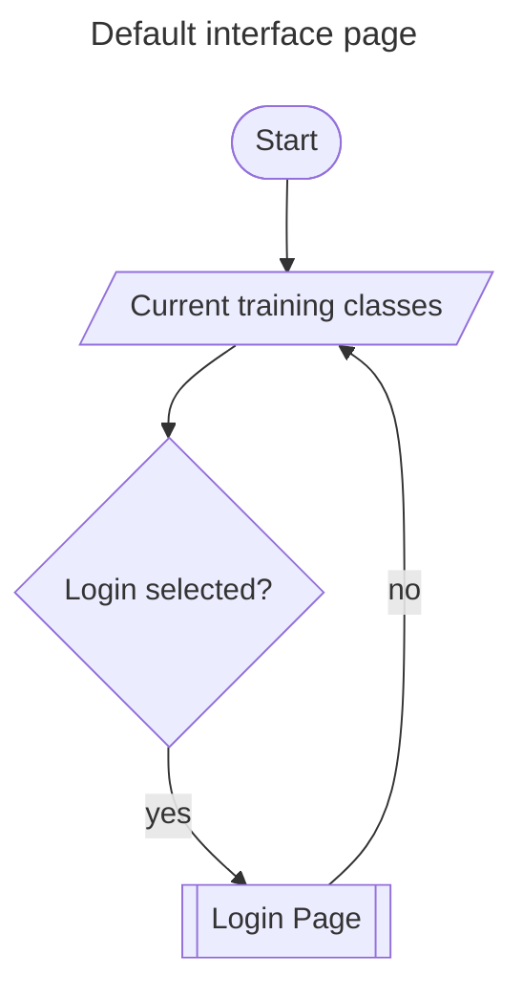
```mermaid
---
title: Default interface page
---
flowchart TD 
    n1([Start])
    --> n2[/Current training classes/]
        --> n3{Login selected?}
            -- yes --> n4[[Login Page]]
            -- no --> n2
```

## User Authentication

### Login Page

This would be presented immediately after clicking the Login button. 

At the start - the staff member would be provided an option to sign up - bringing them to a separate page that is elaborated further below.

For the logic in taking the user's input - the best method identified was through only allowing the input of numbers in the staffID field, continuously parsing entered characters until the set limit of the length of the entry was reached, which in this case for now 4 was chosen.

>[!INFO]
> T

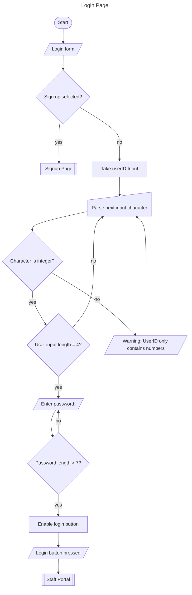
```mermaid
---
title: Login Page
---
flowchart TD 
    n1@{shape: stadium, label: "Start"}
    --> n2@{shape: lean-r, label: "Login form"}
        --> n3@{shape: diamond, label: "Sign up selected?"}
            n3 -- yes ---> n4@{shape: subproc, label: "Signup Page"}
            n3 -- no ---> n5@{shape: process, label: "Take userID Input"}
            n5 --> n6@{shape: manual-input, label: "Parse next input character"}
            n6 --> n7@{shape: diamond, label: "Character is integer?"}
                n7 -- yes --> n8@{shape: diamond, label: "User input length = 4?"}
                    n8 -- no --> n6
                    n8 -- yes --> n10@{shape: lean-r, label: "Enter password:"}
                        n10 --> n11@{shape: diamond, label: "Password length > 7?"}
                            n11 -- yes --> n12@{shape: process, label: "Enable login button"}
                                n12 --> n13@{shape: lean-r, label: "Login button pressed"}
                                    n13 --> n14@{shape: subproc, label: "Staff Portal"}
                            n11 -- no --> n10
            n7 -- no --> n9@{shape: lean-r, label: "Warning: UserID only contains numbers"}
                n9 --> n6
```

### Signup Page

This page would simply tell the staff user to get into contact with an administrator if they want to create an account, it could list general contact information such as a dedicated email associated with that user group. The only other option on this page would be to return to the home default page or to the login page.'

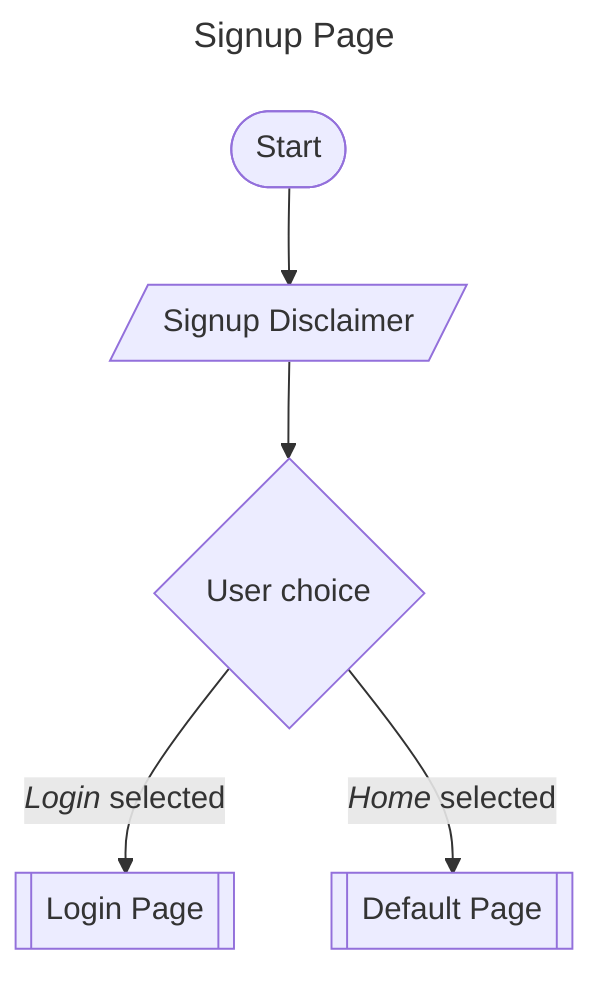
```mermaid
---
title: Signup Page
---
flowchart TD
start([Start])
--> page[/Signup Disclaimer/]
	--> choice{User choice}
		choice -- "`*Login* selected`" --> login[[Login Page]]
		choice -- "`*Home* selected`" --> return[[Default Page]]
```

## 'Booking Menu'

This menu would manage 'bookings' made for repairs at the workshop. Operated by both student and lecturer volunteers.

Here - users would be greeted with a list of bookings they can manage. At the very least - in compliance with the requirements of the brief, the system should allow staff, including student and lecturer volunteers to:
+ Add or modify existing repairs 'added' to the booking - which would include their associated information 
+ Add or modify existing lecturer(s) 'assigned' to supervise the repairs in the booking.
+ Automatically calculate the final cost of the booking from the repairs associated with this (elaborated further in 
+ Change motorist(owner) details associated with the booking, if necessary
+ Change vehicle details associated with the booking, if necessary

This is probably the most expansive part of the implementation which lead to it being split up into multiple separate diagrams for the sub-processes involved.

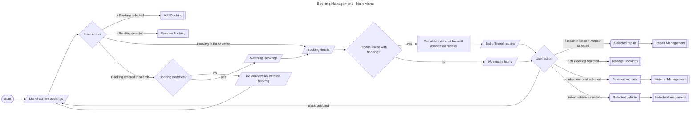
```mermaid
---
title: Booking Management - Main Menu
---
flowchart LR
    start([Start]) --> menu[/List of current bookings/]
    menu --> prompt1{User action}
	    prompt1 -- "`*+ Booking* selected`" --> add[[Add Booking]]
	    prompt1 -- "`*- Booking* selected`" --> del[[Remove Booking]]
        prompt1 -- Booking in list selected --> details[/Booking details/]
        prompt1 -- Booking entered in search --> exist{Booking matches?}
            exist -- no --> nomatch[/"`*No matches for entered booking*`"/] --> menu
            exist -- yes --> match[/Matching Bookings/] --> details
				details --> repair-link{Repairs linked with booking?}
				    repair-link -- yes --> total-cost[Calculate total cost from all associated repairs] --> show-repair[/List of linked repairs/] --> prompt2{User action}
				    repair-link -- no --> no-repair[/"`*No repairs found*`"/] --> prompt2
	        prompt2 -- "`Repair in list or *+ Repair* selected`" --> sel-repair@{shape: bow-rect, label: "Selected repair"} --> repair[[Repair Management]] 
	        prompt2 -- "`*Edit Booking* selected`" --> edit-booking[[Manage Bookings]]
	        prompt2 -- Linked motorist selected --> sel-motorist@{shape: bow-rect, label: "Selected motorist"} --> motorist[[Motorist Management]] 
	        prompt2 -- Linked vehicle selected --> sel-vehicle@{shape: bow-rect, label: "Selected vehicle"} --> vehicle[[Vehicle Management]]
	        prompt2 -- "`*Back* selected`" --> menu
```

### **Create** Booking

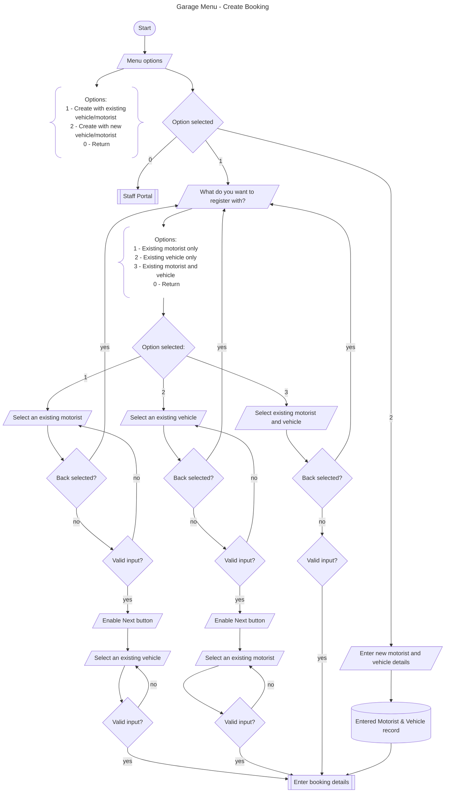
```mermaid
---
title: Garage Menu - Create Booking
---
flowchart TD

n1([Start])
n1 --> n2[/Menu options/]
n2 --> options@{shape: braces, label: "Options: \n 1 - Create with existing vehicle/motorist \n 2 - Create with new vehicle/motorist \n 0 - Return"}
n2 --> n3{Option selected}
n3 -- "0" --> n4a[[Staff Portal]]
n3 -- "1" --> n4b[/What do you want to register with?/]
n4b --> optp@{shape: comment, label: "Options: \n 1 - Existing motorist only \n 2 - Existing vehicle only \n 3 - Existing motorist and vehicle \n 0 - Return"}
optp --> n6{Option selected:}
n6 -- "1" --> n7a[/Select an existing motorist/]
n7a --> n8a{"Back selected?"}
n8a -- yes --> n4b
n8a -- no --> n9a{Valid input?}
n9a -- yes --> n10a[/Enable Next button/]
n10a --> n11a[/Select an existing vehicle/]
n11a --> n12a{Valid input?}
n12a -- yes --> nBooking[[Enter booking details]]
n12a -- no --> n11a
n9a -- no --> n7a
n6 -- "2" --> n7b[/Select an existing vehicle/]
n7b --> n8b{Back selected?}
n8b -- yes --> n4b
n8b -- no --> n9b{Valid input?}
n9b -- yes --> n10b[/Enable Next button/]
n10b --> n12b[/Select an existing motorist/]
n12b --> n13b{Valid input?}
n13b -- yes --> nBooking
n13b -- no --> n12b
n9b -- no --> n7b
n6 -- "3" --> n7c[/Select existing motorist and vehicle/]
n7c --> n8c{Back selected?}
n8c -- yes --> n4b
n8c -- no --> n9c{Valid input?}
n9c -- yes --> nBooking
n3 -- "2" --> n4store[/Enter new motorist and vehicle details/]
n4store --> n5store@{shape: cyl, label: "Entered Motorist & Vehicle record"}
n5store --> nBooking
```

### **Remove** Booking

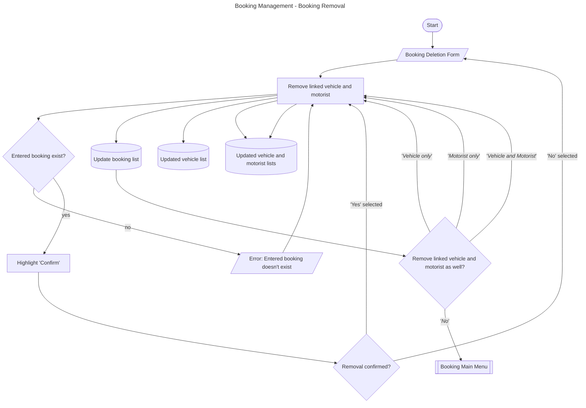
```mermaid
---
title: Booking Management - Booking Removal
---
flowchart TD
start([Start])
--> menu[/Booking Deletion Form/]
	 --> del[/Enter bookings to remove/]
		del --> exist2{Entered booking exist?}
			exist2 -- no --> error[/Error: Entered booking doesn't exist/] --> del
			exist2 -- yes --> enable2[Highlight 'Confirm']
					enable2 --> prompt2{Removal confirmed?}
						prompt2 -- 'No' selected --> menu
						prompt2 -- 'Yes' selected --> del[Remove booking] --> update[(Update booking list)]
					--> cascade-rem{Remove linked vehicle and motorist as well?}
						cascade-rem -- "`'*No*'`" --> return[[Booking Main Menu]]
						cascade-rem -- "`'*Vehicle only*'`" --> del[Remove linked vehicle] --> db1[(Updated vehicle list)] 
						cascade-rem -- "`'*Motorist only*'`"  --> del[Remove linked motorist] --> db2[(Updated motorist list)]
						cascade-rem -- "`'*Vehicle *and* Motorist*'`" --> del[Remove linked vehicle and motorist] --> db2[(Updated vehicle and motorist lists)]
```

### 'Vehicle Management'
Alongside a list of booked repairs, on the same main menu users will be able to oversee a list of vehicles currently booked for repair in accordance to the requirements of the brief. This can be filtered via search bar with a given license plate - which acts as a unique ID for the vehicle as specified earlier in the UML implementation of the class. 

Upon clicking a vehicle entry, they'll be presented with a details page listing associated bookings with it including repairs, which they can add/remove from, taking them to the [[#Repair Menu]] for the specific vehicle.

Furthermore, they'll be able to view the details of the linked owner to the car, which click and jump to the entry details in the separate [[#'Motorist Management']] page if they want to manage anything regarding that.

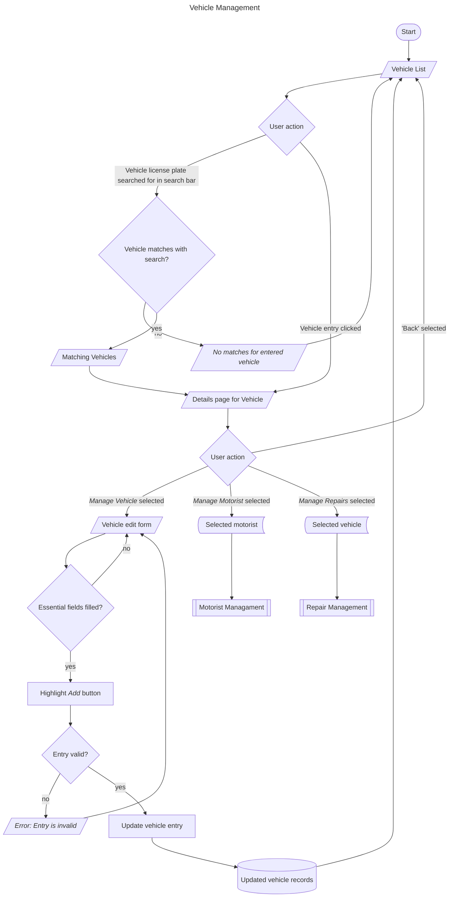
```mermaid
---
title: Vehicle Management
---
flowchart TD 
    start([Start])
    --> menu[/Vehicle List/] --> prompt1{User action}
	    prompt1 -- Vehicle license plate searched for in search bar --> exist{Vehicle matches with search?} 
		exist -- no --> nomatch[/"`*No matches for entered vehicle*`"/] --> menu
	    exist -- yes --> match[/Matching Vehicles/] --> details
	    prompt1 -- Vehicle entry clicked  --> details[/Details page for Vehicle/]
		    details --> prompt2{User action}
			    prompt2 -- "`*Manage Vehicle* selected`" --> edit[/Vehicle edit form/] 
				--> filled{Essential fields filled?}
					filled -- no --> edit
					filled -- yes --> enable-add["`Highlight *Add* button`"]
						enable-add --> valid{"Entry valid?"}
							valid -- no --> invalid[/"`*Error: Entry is invalid*`"/] --> edit
							valid -- yes --> update[Update vehicle entry] --> db[(Updated vehicle records)] --> menu
				prompt2 -- "`*Manage Motorist* selected`" --> sel-motorist@{shape: bow-rect, label: "Selected motorist"} --> motorist[[Motorist Managament]]
			    prompt2 -- "`*Manage Repairs* selected`" --> sel-vehicle@{shape: bow-rect, label: "Selected vehicle"} --> repairs[[Repair Management]]
			    prompt2 -- 'Back' selected --> menu
```

If an entry is clicked on - the usual details page for the specific vehicle is shown, containing it's features alongside the linked owner to it with their contact details. Furthermore the currently assigned bookings to it will be shown where you can update the repair list(s) for them - which will immediately bring you to the 'Manage Repair' form for the booking for the vehicle pre-selected when clicked.

## Repair Menu
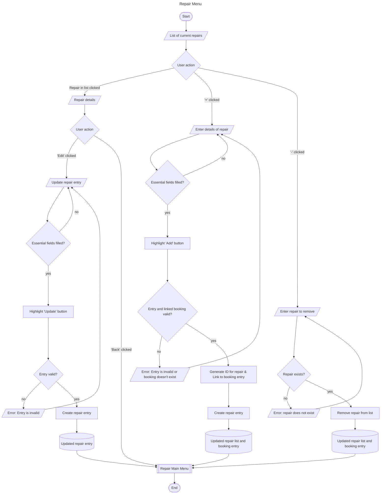
```mermaid
---
title: Repair Menu
---
flowchart TD 
    start([Start])
    --> menu[/List of current repairs/]
        --> prompt1{User action}
            prompt1 -- Repair in list clicked --> details[/Repair details/]
			    details --> prompt2{User action}
				    prompt2 -- 'Edit' clicked --> edit[/Update repair entry/]
						edit --> filled{Essential fields filled?}
				            filled -- no --> edit
				            filled -- yes --> enable-update[Highlight 'Update' button]
					            enable-update --> valid{"Entry valid?"}
								valid -- no --> invalid[/Error: Entry is invalid/] --> edit
								valid -- yes --> update[Create repair entry]
								    --> db[(Updated repair entry)] --> return[[Repair Main Menu]]
				    prompt2 -- 'Back' clicked --> return
            prompt1 -- '+' clicked --> new[/Enter details of repair/]
	            new --> filled2{Essential fields filled?}
		            filled2 -- no --> new
		            filled2 -- yes --> enable-add[Highlight 'Add' button]
			            enable-add --> valid2{Entry and linked booking valid?}
				            valid2 -- no --> invalid2[/Error: Entry is invalid or booking doesn't exist/] --> new
				            valid2 -- yes --> gen[Generate ID for repair & Link to booking entry]
					            --> update2[Create repair entry]
							    --> db2[(Updated repair list and booking entry)] --> return
            prompt1 -- '-' clicked --> del[/Enter repair to remove/]
	            del --> exist{Repair exists?}
		            exist -- no --> invalid3[/Error: repair does not exist/] --> del
		            exist -- yes --> update3[Remove repair from list]
			            --> db3[(Updated repair list and booking entry)] --> return --> finish([End])
```

## 'Motorist Management'
This acts as a separate menu in contrast to the vehicle one as motorists can not only be at the workshop for repairs, but also for training classes. In some cases it may even be both, necessitating a common menu where both repair and teaching volunteers can manage motorists.

Users will be able to oversee a list of motorists and be able to manage them - including adding new motorists and linking them to a vehicle or removing multiple of them. The intention of offering this as a separate menu is so users can quickly add multiple new motorists as is without worrying about linking them to vehicles or repairs or assigning them to a training class.

In the specific case of repair volunteers specifically as well, they'll be able to manage vehicles associated with them.

Due to the complexity in the logic of the motorist menu, it has been split into multiple flowcharts.

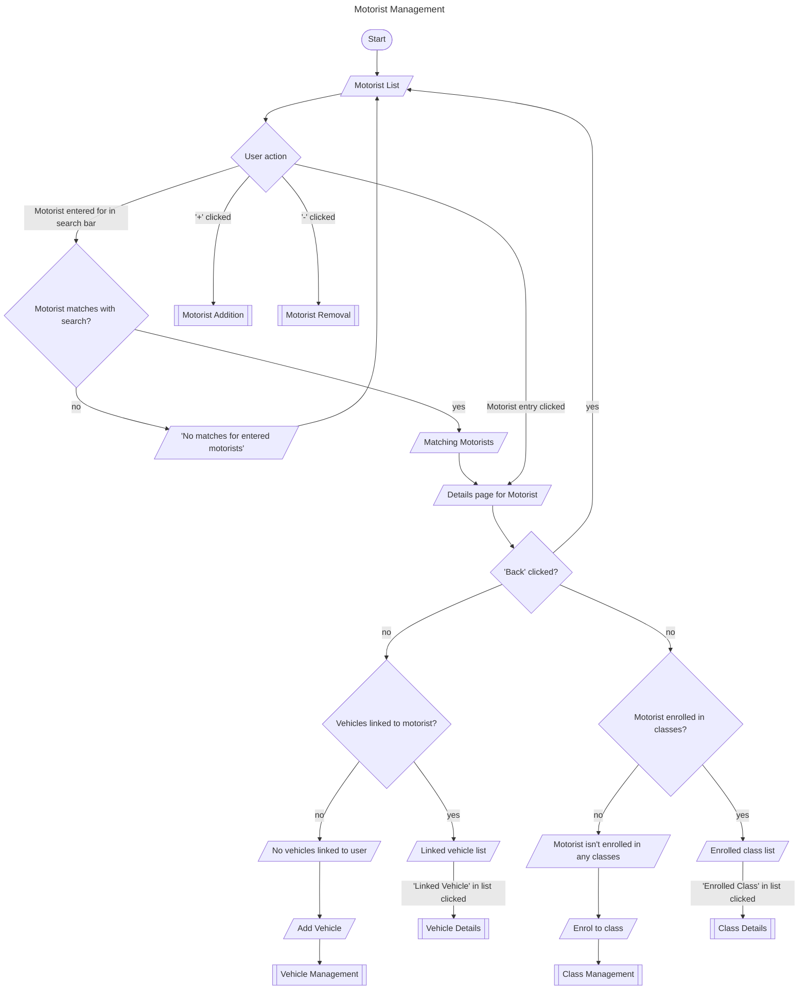
```mermaid
---
title: Motorist Management
---
flowchart TD 
    start([Start])
    --> menu[/Motorist List/] --> prompt1{User action}
	    prompt1 -- Motorist entered for in search bar --> exist{Motorist matches with search?} 
		exist -- no --> nomatch[/'No matches for entered motorists'/] --> menu
	    exist -- yes --> match[/Matching Motorists/] --> details
	    prompt1 -- Motorist entry clicked  --> details[/Details page for Motorist/]
		    details --> prompt2{'Back' clicked?}
			    -- no --> linked-veh{Vehicles linked to motorist?}
				    linked-veh -- no --> no-link[/No vehicles linked to user/]
					    no-link --> add[/Add Vehicle/] --> addveh[[Vehicle Management]]
				    linked-veh -- yes --> yes-link[/Linked vehicle list/]
						yes-link -- 'Linked Vehicle' in list clicked --> details2[[Vehicle Details]]
				prompt2 -- no --> enrol-class{Motorist enrolled in classes?}
					enrol-class -- no --> no-class[/Motorist isn't enrolled in any classes/]
					    no-class --> add-class[/Enrol to class/] --> addclass[[Class Management]]
				    enrol-class -- yes --> yes-class[/Enrolled class list/]
						yes-class -- 'Enrolled Class' in list clicked --> details3[[Class Details]]
			    prompt2 -- yes --> menu
	    prompt1 -- '+' clicked  --> addition[[Motorist Addition]]
	    prompt1 -- '-' clicked  --> removal[[Motorist Removal]]
```

### **Adding** a Motorist
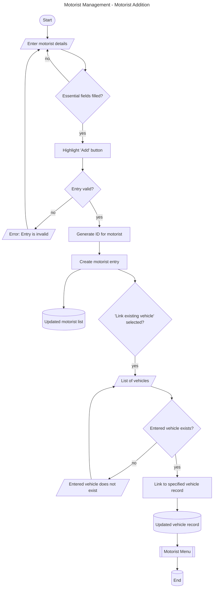
```mermaid
---
title: Motorist Management - Motorist Addition
---
flowchart TD 
start([Start])
 --> new[/Enter motorist details/]
	 --> filled{Essential fields filled?}
			filled -- no --> new
			filled -- yes --> enable-add[Highlight 'Add' button]
				enable-add --> valid{"Entry valid?"}
					valid -- no --> invalid[/Error: Entry is invalid/] --> new
					valid -- yes --> gen[Generate ID for motorist]
						--> update[Create motorist entry] --> db[(Updated motorist list)]
							update --> link-vehicle{'Link existing vehicle' selected?}
								link-vehicle -- yes --> veh-list[/List of vehicles/] 
									veh-list --> veh-exist{Entered vehicle exists?}
										veh-exist -- no --> invalid2[/Entered vehicle does not exist/] --> veh-list
										veh-exist -- yes --> link[Link to specified vehicle record] --> db2[(Updated vehicle record)]  --> return[[Motorist Menu]] --> finish[(End)]
```

###  **Removing** a Motorist

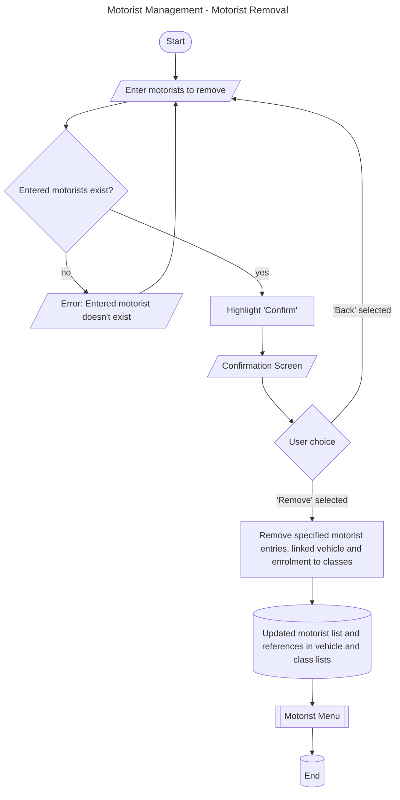
```mermaid
---
title: Motorist Management - Motorist Removal
---
flowchart TD
start([Start])
 --> del[/Enter motorists to remove/]
		del --> exist2{Entered motorists exist?}
			exist2 -- no --> error[/Error: Entered motorist doesn't exist/] --> del
			exist2 -- yes --> enable2[Highlight 'Confirm']
				enable2 --> confirm[/Confirmation Screen/]
					confirm --> prompt2{User choice}
						prompt2 -- 'Back' selected --> del
						prompt2 -- 'Remove' selected --> remove[Remove specified motorist entries, linked vehicle and enrolment to classes] 
						--> db3[(Updated motorist list and references in vehicle and class lists)] --> return[[Motorist Menu]] --> finish[(End)]
```

## Training Class Menu

This is another menu that would only be accessible by student users. 

Upon clicking the menu entry, they will be greeted with a 'timetable' of the classes every given Saturday, with an option to advance it to the next or previous ones. This would likely presented through an embedded scheduler or day calender component in the web implementation.

Below would be the list of training classes created. These entries will be in a table-like format including columns for important data such as their type, date and student delivering the class.

The table format should therefore in theory allow the list to be easily filterable by date alongside the student 'delivering' the class as the brief states.

Beyond the list, there would be an option of 'all attendees' where they can view a filterable list of all motorists attending classes including details associated with them such as classes they attended as well as their calculated attendance rate from classes they attended prior from which additional functionality can be introduced such as sending emails to attendees whose attendance drops below a certain threshold and obtain feedback why they don't attend the classes anymore.

If they want to perform an action to an existing class they must first click it where they'll be greeted with a details page and the management actions that can be done including:
+ Modifying the attendee list of the class, including:
  + 'Enrolling' a new student to the class, either assigning one from an existing 'visitor' or creating a new one
  + 'De-enrolling' an existing one.
+ Modifying the date of the class 
+ Modifying the student volunteer assigned to teach the class

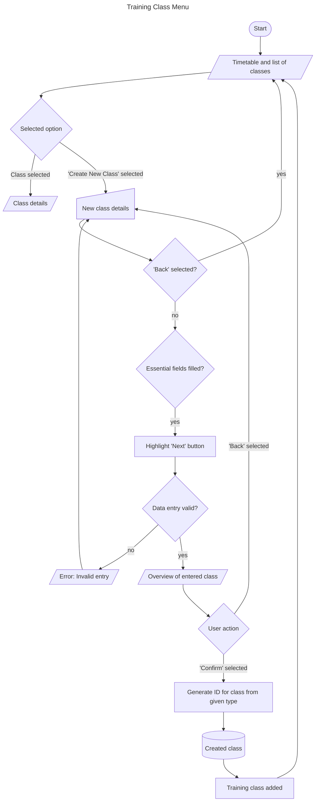
```mermaid
---
title: Training Class Menu
---
flowchart TD 
    n1([Start])
    --> menu[/Timetable and list of classes/]
        --> prompt1{Selected option}
            prompt1 -- Class selected --> details[/Class details/]
            prompt1 -- 'Create New Class' selected --> newclass@{shape: manual-input, label: "New class details"}
	        newclass --> back{'Back' selected?}
		        back -- yes --> menu
		        back -- no --> filled{Essential fields filled?}
			        filled -- yes --> enablebtn[Highlight 'Next' button]
				        enablebtn --> valid{Data entry valid?}
						valid -- no --> error[/Error: Invalid entry/] --> newclass
			            valid -- yes --> overview[/Overview of entered class/]
				            overview --> confirm{User action}
					            confirm -- 'Back' selected --> newclass
					            confirm -- 'Confirm' selected --> idgen[Generate ID for class from given type]
						            idgen --> store[(Created class)]
							            store --> success[Training class added] --> menu
```

### Creating a Class

Upon clicking the create class button, the user would be brought to a form where they can enter the details about the class. Essential fields would include the name, obvious valid date on a Saturday set,  duration, set class type from a predefined list in a dropdown alongside an assigned student volunteer. If those fields are filled, the 'Next' button will be highlighted. After which if clicked will only present the summary page if the input data is valid. 

The summary page offers the user another chance to look over their entered data and return to make any amendments if needed. From there they can confirm where a suitable ID depending on the type assigned to the class will be generated and assigned to it. Thus finally creating it's entry in the training class table.

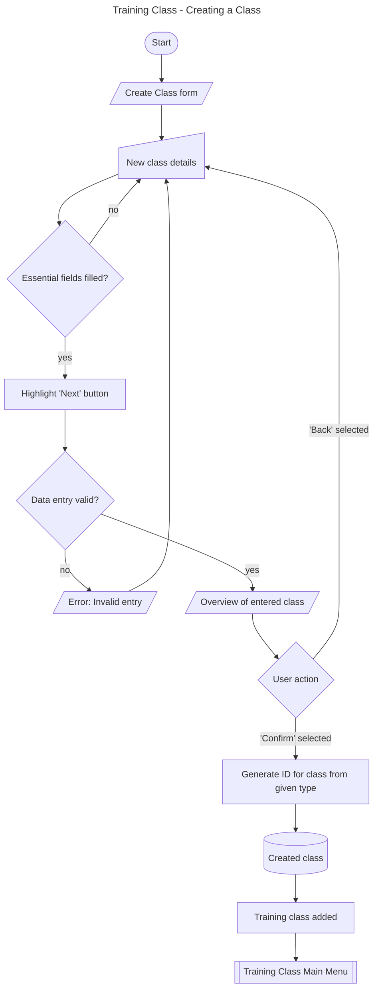
```mermaid
---
title: Training Class - Creating a Class
---
flowchart TD 
    n1([Start])
    --> menu[/Create Class form/]
            --> newclass@{shape: manual-input, label: "New class details"}
	        newclass
		         --> filled{Essential fields filled?}
					filled -- no --> newclass
			        filled -- yes --> enablebtn[Highlight 'Next' button]
				        enablebtn --> valid{Data entry valid?}
						valid -- no --> error[/Error: Invalid entry/] --> newclass
			            valid -- yes --> overview[/Overview of entered class/]
				            overview --> confirm{User action}
					            confirm -- 'Back' selected --> newclass
					            confirm -- 'Confirm' selected --> idgen[Generate ID for class from given type]
						            idgen --> store[(Created class)]
							            store --> success[Training class added] --> return[[Training Class Main Menu]]
```

### Managing Enrolment

This feature is one of the functions that are presented to users when they click on a class in the list - bringing them to it's dedicated details page. 

Managing Enrolment will include both enrolling attendees to created classes as well as de-enrolling them. 

The concept is that after clicking the 'Add' button at the top of the list component, volunteers can simply enter the first few letters of a name to receive suggestions matching that, greatly streamlining the process. 

When de-enrolling the user will be offered an option to remove the selected attendee from the motorist record entirely if they wish to not attend any further classes in compliance with GDPR.

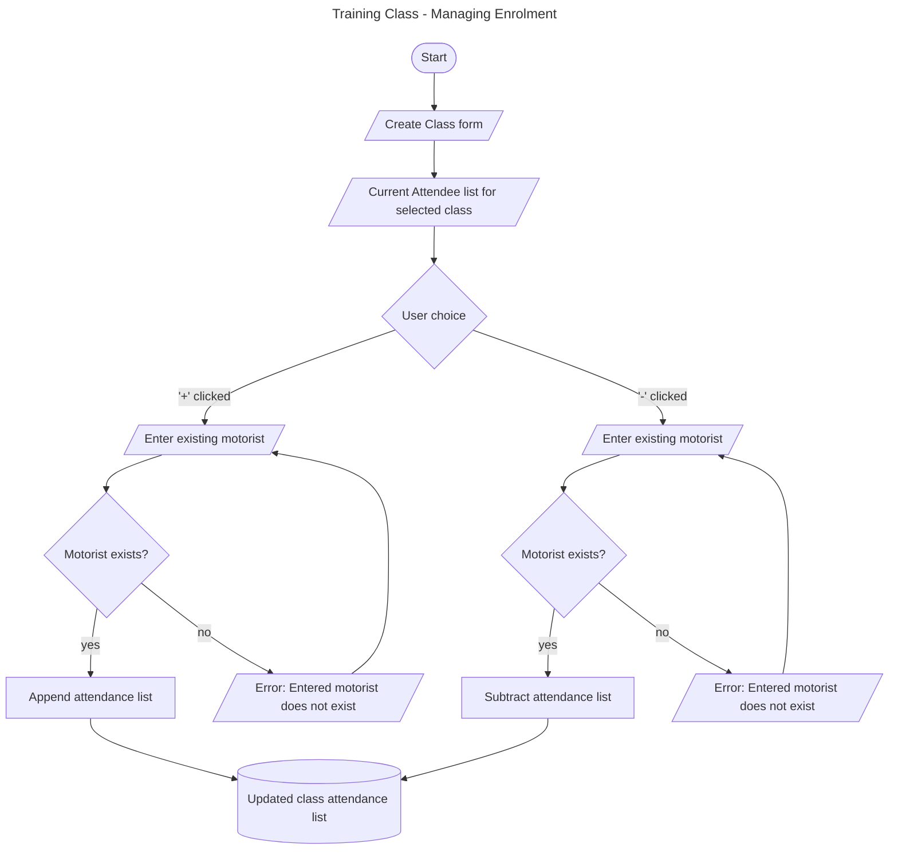
```mermaid
---
title: Training Class - Managing Enrolment
---
flowchart TD 
    n1([Start])
    --> menu[/Create Class form/]
            --> newclass[/Current Attendee list for selected class/]
	        newclass --> choice{User choice}
		        choice -- '+' clicked --> add[/Enter existing motorist/] 
			        add --> exist{Motorist exists?}
				        exist -- yes --> update[Append attendance list] --> newdb[(Updated class attendance list)]
					    exist -- no --> notexist[/Error: Entered motorist does not exist/] --> add
		        choice -- '-' clicked --> del[/Enter existing motorist/] 
				del --> exist2{Motorist exists?}
				exist2 -- yes --> update2[Subtract attendance list] --> newdb
				exist2 -- no --> notexist2[/Error: Entered motorist does not exist/] --> del
```

### Modifying a Class 

The 'Modify' button is another feature that is available when a class's detailed page is accessed. Here volunteers can make quick changes to classes where needed: including their name, description, date without needing to recreate them.

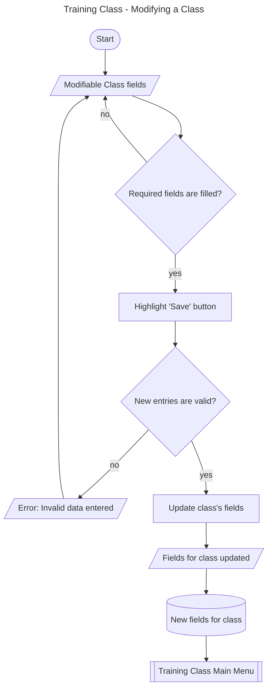
```mermaid
---
title: Training Class - Modifying a Class
---
flowchart TD 
    start([Start])
    --> menu[/Modifiable Class fields/]
			--> filled{Required fields are filled?}
					filled -- no --> menu
					filled -- yes --> enable-btn[Highlight 'Save' button]
						--> valid{New entries are valid?}
							valid -- no --> invalid[/Error: Invalid data entered/] --> menu 
							valid -- yes --> update[Update class's fields]
								--> success[/"Fields for class updated"/] --> db[(New fields for class)]
								 --> return[[Training Class Main Menu]]
```

## Student Panel
The main users of the system, they will be greeted with a dashboard upon login with components of bookings and thus repairs assigned to them upfront alongside a list of created classes. 

Clicking any of the entries in these components will bring the user to the respective details page of them as a shortcut. Otherwise, they can select any entry in the menubar, which is what the flowchart below displays.

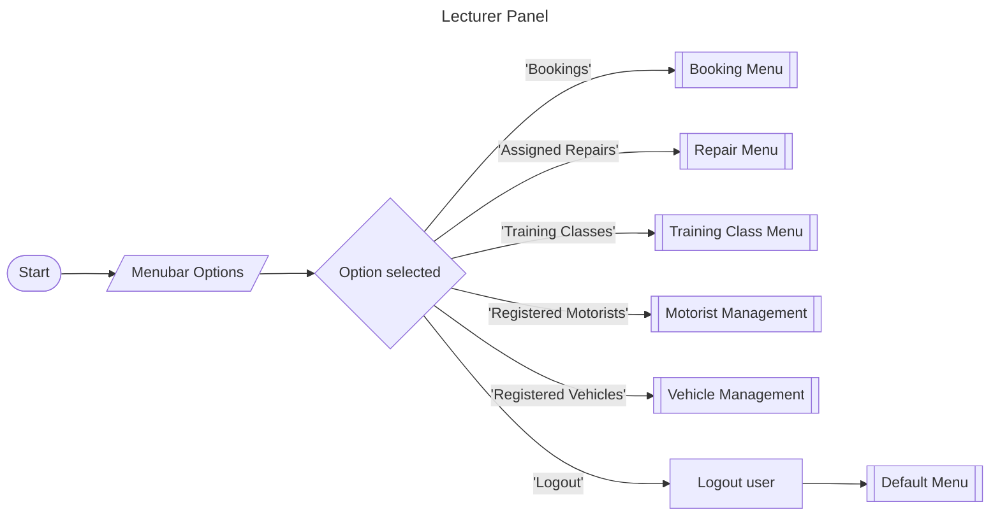
```mermaid
---
title: Lecturer Panel 
---
flowchart LR 
start([Start])
    --> menu[/Menubar Options/]
		    --> prompt{Option selected}
			    prompt -- 'Bookings' --> booking[[Booking Menu]]
			    prompt -- 'Assigned Repairs' --> repair[[Repair Menu]]
			    prompt -- 'Training Classes' --> clas[[Training Class Menu]]
			    prompt -- 'Registered Motorists' --> motorist[[Motorist Management]]
			    prompt -- 'Registered Vehicles' --> vehicle[[Vehicle Management]]
			    prompt -- 'Logout' --> logout[Logout user] --> return[[Default Menu]]
```

## Lecturer Panel
The lecturer panel is a specific page lecturers are greeted when logging in, their experience differs from student volunteers in that they will only be presented with options relating to bookings made as well as repairs due to the brief specifying that they merely take a supervisory role during repairs. 

Similar to student volunteers, not every lecturer would be given an account, this is implemented in the case a lecturer would like access to the system.

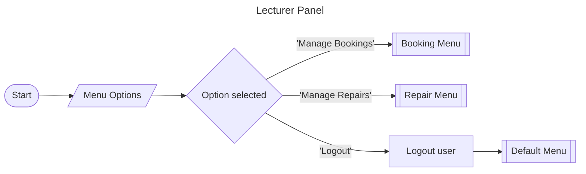
```mermaid
---
title: Lecturer Panel 
---
flowchart LR 
start([Start])
    --> menu[/Menu Options/]
		    --> prompt{Option selected}
			    prompt -- 'Manage Bookings' --> booking[[Booking Menu]]
			    prompt -- 'Manage Repairs' --> repair[[Repair Menu]]
			    prompt -- 'Logout' --> logout[Logout user] --> return[[Default Menu]]
```

### Admin Panel
The admin panel is similar in nature to the lecturer one - they will exclusively be presented with administration-related options including user management, allowing for:
+ User addition or removal with their linked Staff ID
+ Staff entry removal 
+ Manually reset passwords for users
+ User access control and assigning privileges, which will affect their panel experience.

Due to their role being the most specialised, they will be greeted with the user list and management controls upfront after logging in
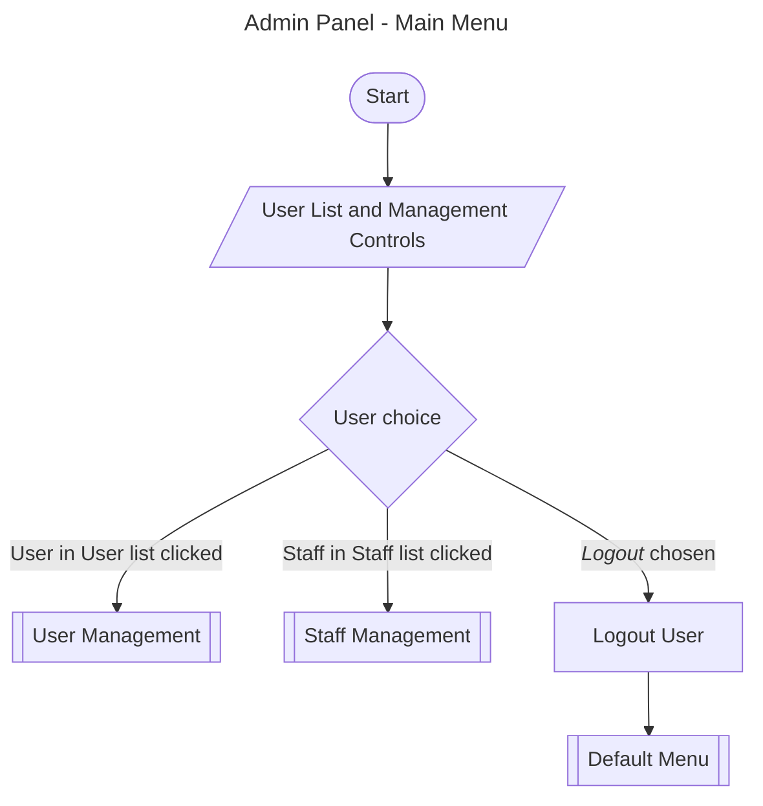
```mermaid
---
title: Admin Panel - Main Menu
---
flowchart TD
start([Start])
	--> menu[/User List and Management Controls/]
		--> choice{User choice}
				choice -- User in User list clicked --> usr-menu[[User Management]] 
				choice -- Staff in Staff list clicked --> staff-menu[[Staff Management]]
				choice -- "`*Logout* chosen`" --> logout[Logout User] --> return[[Default Menu]]
```

### User Management
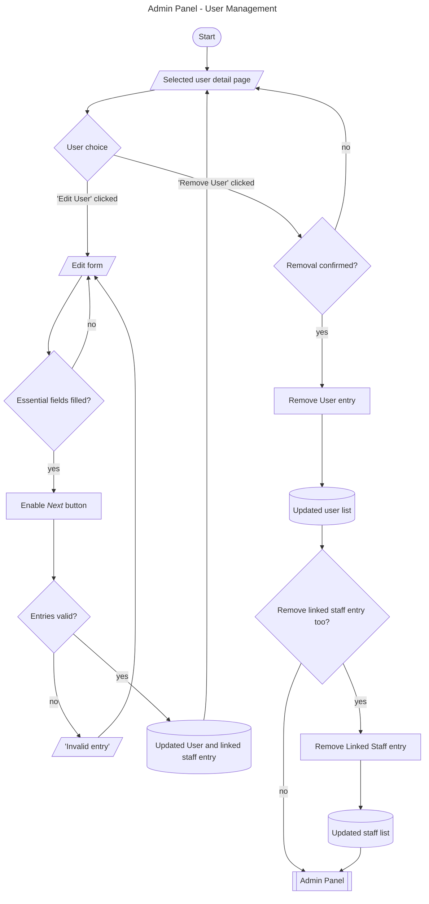
```mermaid
---
title: Admin Panel - User Management
---
flowchart TD
start([Start])
--> usr-menu[/Selected user detail page/] 
	 --> choice2{User choice}
		choice2 -- 'Edit User' clicked --> edit[/Edit form/]
			edit --> filled{Essential fields filled?} 
				filled -- no --> edit
				filled -- yes --> highlight-btn["`Enable *Next* button`"]
					--> valid{Entries valid?} 
						valid -- no --> invalid[/'Invalid entry'/] --> edit
						valid -- yes --> update[(Updated User and linked staff entry)] --> usr-menu
		choice2 -- 'Remove User' clicked --> confirm{Removal confirmed?}
		confirm -- no --> usr-menu
		confirm -- yes --> rem1[Remove User entry] --> db[(Updated user list)] 
		--> staffrem{Remove linked staff entry too?} 
			staffrem -- no --> menu[[Admin Panel]]
			staffrem -- yes --> del2[Remove Linked Staff entry] --> db2[(Updated staff list)] --> menu
```

### Staff Management

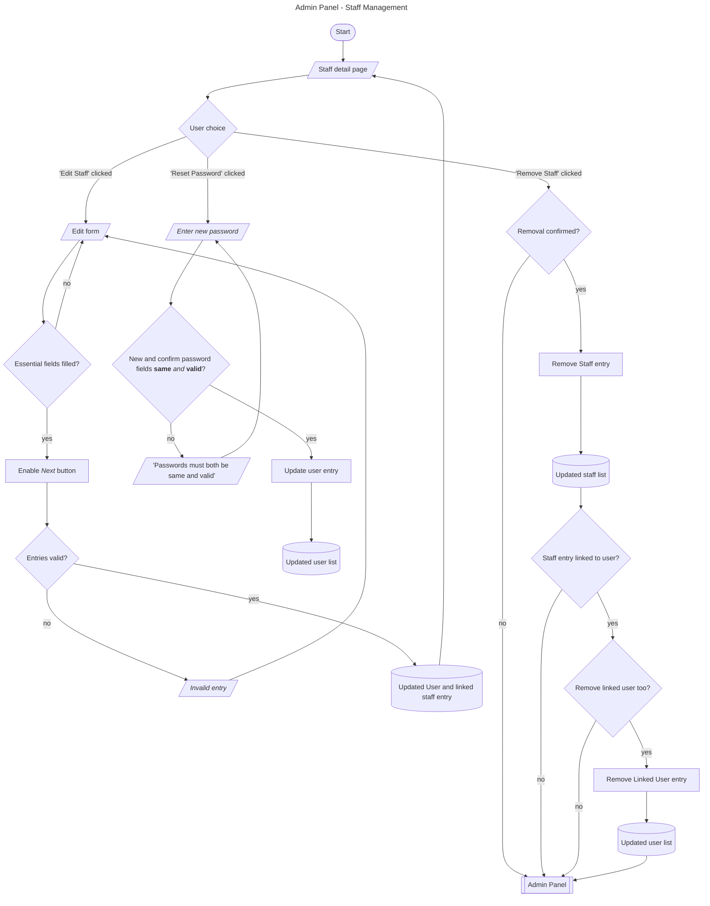
```mermaid
---
title: Admin Panel - Staff Management
---
flowchart TD
start([Start])
--> staff-menu[/Staff detail page/] --> choice3{User choice}
					choice3 -- 'Edit Staff' clicked --> edit[/Edit form/]
						 --> filled{Essential fields filled?} 
							 filled -- no --> edit
							 filled -- yes --> highlight-btn["`Enable *Next* button`"]
								--> valid{Entries valid?} 
									valid -- no --> invalid[/"`*Invalid entry*`"/] --> edit
									valid -- yes --> update[(Updated User and linked staff entry)] --> staff-menu
					choice3 -- 'Reset Password' clicked --> newpass[/"`*Enter new password*`"/] 
						--> validpass{"`New and confirm password fields **same** *and* **valid**?`"}
							validpass -- no --> invalidpass[/'Passwords must both be same and valid'/] --> newpass
							validpass -- yes --> update2[Update user entry] --> db[(Updated user list)]
					choice3 -- 'Remove Staff' clicked --> confirm2{Removal confirmed?}
						confirm2 -- no --> menu[[Admin Panel]] 
						confirm2 -- yes --> rem2[Remove Staff entry] --> db2[(Updated staff list)]
						--> linked{Staff entry linked to user?}
							 linked -- no -->  menu
							 linked -- yes --> userrem{Remove linked user too?} 
								userrem -- no --> menu
								userrem -- yes --> del3[Remove Linked User entry] --> db4[(Updated user list)] --> menu
```

